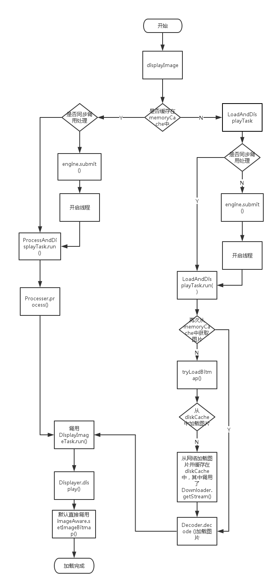
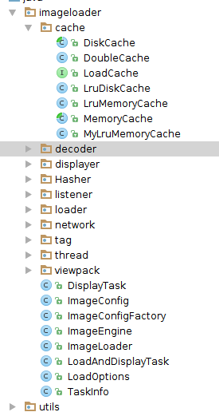

## 打造自己的Android-Universal-Image-Loader

最近阅读了Android-Universal-Image-Loader的源码，又正在学习设计模式，就写一个ImageLoader练练手。

大概分为以下几个步骤吧，
* 简要介绍一下Android-Universal-Image-Loader源码
* 在阅读源码的基础上搭建我们的ImageLoader架构，其中穿插一些自己对设计模式的理解
* 编码实现

#### 1. 简要介绍一下Android-Universal-Image-Loader的实现。
网上有很多关于Android-Universal-Image-Loader源码解析，这里只简要介绍一下。
Android-UIL中最主要的函数就是Imageloader.displayImage();下面流程图显示了整个调用流程

Android-UIL中主要有几个重要的类：
* ImageLoader
  图片加载等主要调用的类，使用了单例。
  1. 主要成员变量
  ImageLoaderConfiguration configuration; // 保存主要的配置 用了Builder模式
  ImageLoaderEngine engine; // 用于派发异步任务
  ImageLoaderListener listener; // 回调监听接口
  ImageLoader instance; // 单例实例
  
  2. 主要函数
  init(); // 主要用于初始化ImageLoader， 设置Configuration以及初始化engine
  displayImage(); // 加载图片并显示到 view 中
  loadImage(); // 加载图片到缓存中并调用回调接口，并不显示，其最后还是调用了displayImage()，其实最重要的就是displayImage()了，其中主要调用了 ProcessAndDisplayTask 和 LoadAndDisplayTask 的run 函数，具体的加载过程可以看看上面的流程图再结合代码看一下。
  
* ImageLoaderConfiguration
  配置信息类，保存了配置信息，用了 Builder 模式
  1. 主要成员变量
  MemoryCache
  DiskCache
  ImageDownloader
  ImageDecoder
  DisplayImageOptions
  等等，可以参考源码看一下，主要是保存之后在ImageLoader中调用
  2. 主要函数
  createDefault(); // 返回一个默认的 Builder

* ImageLoaderEngine
  将任务分发到具体的线程池中
  1. 主要成员变量
  主要就是三个线程池
  Executor taskExecutor; // 用于从源获取图片的线程池
  Executor taskExecutorForCachedImages; // 从缓存池中获取图片的线程池
  Executor taskDistributor; // 分发任务的线程池，把任务分发到上面两个线程池中
  
  2. 主要函数
  submit(); // 提交任务线程
  
* ProcessAndDisplayTask
  处理图片并显示
  主要函数
  run(); // 此函数中主要有两个处理步骤，1. 调用BitmapProcessor对bitmap进行处理 2. 调用DisplayBitmapTask 显示图片，主要的逻辑又转移到了DisplayBitmapTask的run函数中。
  
* LoadAndDisplayTask
  加载图片并显示
  主要函数
  run(); // 先监测memoryCache中是否缓存有图片，有的话直接调用DisplayBitmapTask进行显示，没有的话从diskCache中加载，diskCache中也没有的话就从网络或者其他源进行加载。
  
* DisplayBitmapTask
  显示图片
  主要函数
  run(); // 直接调用Displayer的display函数，之后调用回调函数listener.onLoadingComplete()
  
* Displayer
  显示器接口，
  主要函数
  display();
  
* MemoryCache
  内存缓存
  主要函数
  put();
  get();
  remove();
  keys();
  clear();
  
* DiskCache
  内存卡缓存
  主要函数
  getDirectory();
  get();
  save();
  remove();
  close();
  clear();
  
* ImageDownloader
  加载指定源的图片流
  主要函数
  getStream();
  
#### 2. 总结一些用到的设计模式 

* 六大设计原则
  * 单一职责
  * 开闭原则
  * 里氏替换
  * 依赖倒置
  * 接口隔离
  * 迪米特法则
* 单例模式
* Builder模式
* 外观模式
* 工厂模式

#### 3. 设计整体框架
项目目录如下：

下面是各个类的一些主要成员变量和成员函数
* ImageLoader
 * ImageConfig
 * ImageEngine
 * ImageLoader instance
 * displayImage()
 * loadImage()
* ImageEngine
 * ThreadPool
 * submit()
* LoadAndDisplayTask
 * run()
* DisplayTask
 * run()
* ImageConfig
 * Decoder
 * Loader
 * Displayer
 * HttpConnection
 * ThreadPool
 * MemoryCache
 * DiskCache
 * class Builder
* ImageConfigFactory
 * getDefaultXXX()
* Decoder
 * decode()
* Displayer
 * display()
* Loader
 * load()
 
#### 4. 具体编码如下
[ImageLoader地址](https://github.com/5A59/ImageLoader)